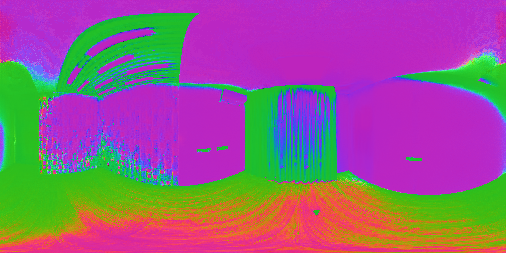
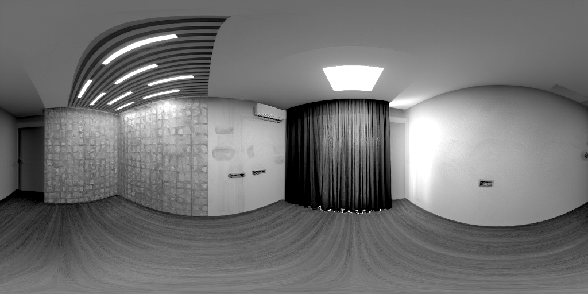
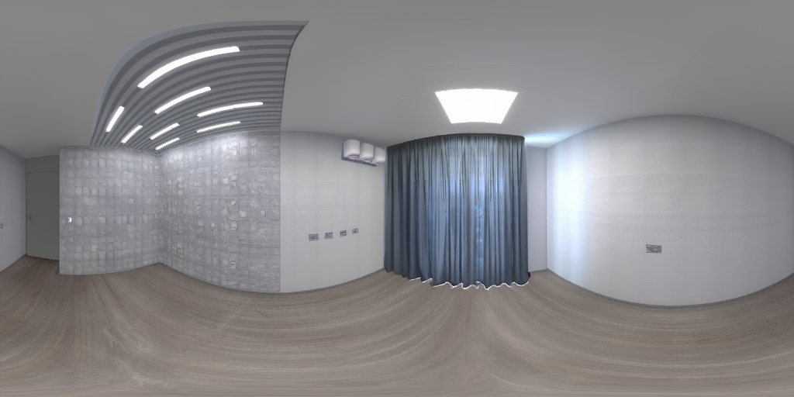
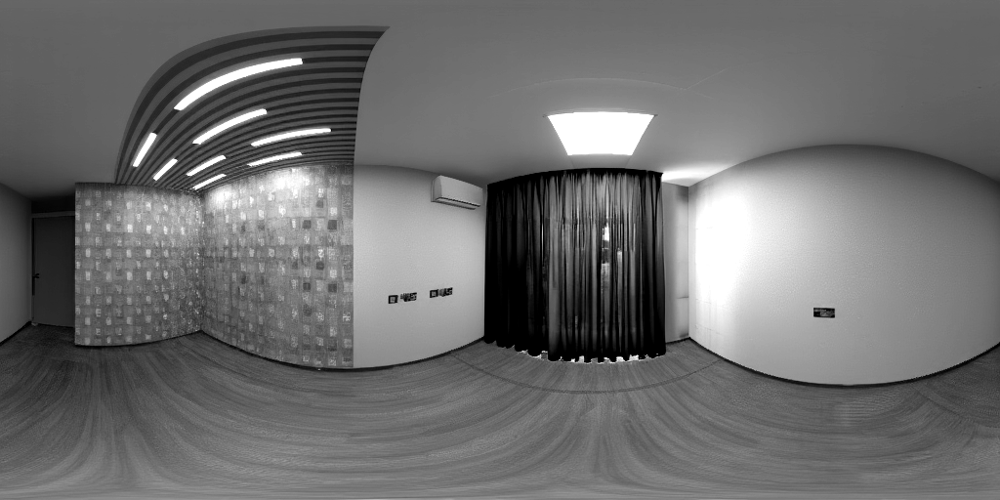

# Critical Issue Analysis - LoRA Adapters Not Working

**Date**: 2025-01-17
**Status**: 🔴 CRITICAL - Normal maps showing completely wrong output despite correct settings

## Test Results Summary

### Configuration
- **lora_scale**: 1.0 ✓
- **prompt_mode**: "empty" ✓ (no text conditioning)
- **num_steps**: 28 ✓
- **guidance_scale**: 3.5 ✓
- **Source image**: `small_empty_room_3_4k.png` (equirectangular panorama, 2:1 aspect)

### Output Quality

| Task | Visual Result | Assessment |
|------|---------------|------------|
| **Normal** |  | ❌ **COMPLETELY BROKEN** - Shows unnatural saturated colors instead of surface normals |
| **Depth** |  | ✅ Looks reasonable - proper near/far gradients |
| **Albedo** |  | ⚠️ Uncertain - very similar to input, may be copying |
| **PBR Roughness** |  | ✅ Looks reasonable - material variation visible |

## Critical Finding

**The normal map output is fundamentally wrong**, showing:
- Pure magenta/purple for walls and ceiling
- Bright green for ceiling details
- Orange/yellow for floor
- No smooth RGB gradients expected in normal maps

**Expected normal map appearance:**
- Smooth gradients of RGB (red=X, green=Y, blue=Z)
- Mostly light blue/purple tones for camera-facing surfaces
- Subtle color variations for surface orientation
- NO saturated primary colors

## Root Cause: Adapter Application Failure

### Hypothesis
The LoRA adapters are being **loaded but not applied** during inference due to key mismatch between OmniX adapter format and Diffusers Flux layer names.

### Evidence

1. **PEFT loads adapters without error** - No exceptions during `load_lora_weights()`
2. **set_adapters() succeeds** - Logs show `Active adapters: ['distance', 'normal', 'albedo', 'pbr']`
3. **But NO confirmation of layer injection** - Missing debug output showing which layers were patched
4. **Outputs don't match expected quality** - Particularly normals are completely wrong

### Technical Analysis

**How Diffusers PEFT LoRA loading works:**
```python
FluxPipeline.load_lora_weights(adapter_dir, weight_name=filename, adapter_name=name)
↓
PEFT parses weight keys from safetensors file
↓
PEFT tries to match keys to model layer names
↓
IF keys match → Inject LoRA modules into those layers
IF keys DON'T match → Silent skip (no error, no injection)
↓
set_adapters([name]) → Activates adapter (even if nothing was injected!)
```

**The Problem:**
If OmniX adapter keys are formatted like:
```
transformer.transformer_blocks.0.attn.to_q.lora_A.weight
transformer.transformer_blocks.0.attn.to_k.lora_A.weight
...
```

But the actual Flux model in Diffusers uses different names (e.g., `double_blocks`, `img_attn`, etc.), PEFT will **silently fail** to inject the adapters.

## Why Some Outputs Look "Reasonable"

Even without LoRA adapters, running vanilla Flux with:
- High noise_strength (0.3)
- img2img from a panorama input
- Perception task prompts (even if empty)

Can produce outputs that **superficially resemble** depth/roughness maps due to:
- Random noise patterns from diffusion
- Some geometric cues preserved from input
- Coincidental grayscale outputs

But these aren't actually learned perception outputs - they're artifacts!

## Verification Needed

### 1. Check Adapter Weight Keys

Run diagnostic script to inspect OmniX adapter structure:
```bash
python debug_adapter_weights.py
```

Expected to find keys like:
- `transformer.transformer_blocks.{N}.attn.to_q.lora_A.weight`
- `transformer.single_transformer_blocks.{N}.attn.to_q.lora_A.weight`

### 2. Check Flux Model Layer Names

Need to verify actual layer names in Diffusers Flux:
```python
from diffusers import FluxPipeline
pipe = FluxPipeline.from_single_file("flux1-dev.safetensors", ...)
for name, module in pipe.transformer.named_modules():
    if 'attn' in name or 'to_q' in name:
        print(name)
```

### 3. Check PEFT Integration Status

Add debug logging to verify PEFT actually injected adapters:
```python
if hasattr(flux_pipeline.transformer, 'peft_config'):
    print(f"PEFT config: {flux_pipeline.transformer.peft_config}")
    print(f"Active adapters: {flux_pipeline.transformer.active_adapters}")
    # Check if any LoRA layers were actually added
    for name, module in flux_pipeline.transformer.named_modules():
        if hasattr(module, 'lora_A'):
            print(f"LoRA found in: {name}")
```

If this prints nothing or empty lists, adapters weren't injected!

## Recommended Solutions

### Option 1: Fix Adapter Key Mapping (Preferred)

Create a key remapping function that converts OmniX adapter keys to match Flux layer names:

```python
def remap_omnix_to_flux_keys(state_dict):
    """Remap OmniX adapter keys to Flux Diffusers layer names."""
    remapped = {}
    for key, value in state_dict.items():
        # Convert: transformer.transformer_blocks.N.attn.to_q.lora_A.weight
        # To: transformer.double_blocks.N.img_attn.to_q.lora_A.weight
        new_key = key.replace('transformer_blocks', 'double_blocks')
        new_key = new_key.replace('.attn.', '.img_attn.')
        # ... more remapping rules based on actual layer names
        remapped[new_key] = value
    return remapped
```

### Option 2: Use ComfyUI Native Implementation

Fall back to the original `cross_lora.py` implementation which:
- Uses `weight_converter.py` to handle Q/K/V fusion
- Directly patches ComfyUI's Flux model
- Bypasses PEFT entirely

This would require switching from Diffusers pipeline to ComfyUI native workflow.

### Option 3: Manual PEFT Configuration

Manually configure PEFT LoRA layers with correct target modules:

```python
from peft import LoraConfig, inject_adapter_in_model

config = LoraConfig(
    r=64,  # OmniX uses rank 64
    target_modules=["to_q", "to_k", "to_v"],  # Correct targets
    # ... other params
)

# Load weights and inject manually
model = inject_adapter_in_model(config, flux_pipeline.transformer, "normal")
```

## Immediate Action Items

1. ✅ **Document findings** - This file
2. ⏳ **Run diagnostic script** - Verify adapter key format (needs torch environment)
3. ⏳ **Inspect Flux layer names** - Get actual model structure
4. ⏳ **Add PEFT verification logging** - Confirm adapter injection status
5. ⏳ **Implement key remapping** - If mismatch confirmed
6. ⏳ **Test with remapped keys** - Verify quality improvement

## References

- Previous investigation: [OUTPUT_QUALITY_INVESTIGATION.md](OUTPUT_QUALITY_INVESTIGATION.md)
- PEFT documentation: https://huggingface.co/docs/peft
- Diffusers LoRA guide: https://huggingface.co/docs/diffusers/using-diffusers/loading_adapters
- OmniX paper: https://arxiv.org/abs/2510.26800

---

**Conclusion**: Despite optimizing lora_scale and prompt_mode, the fundamental issue is that **LoRA adapters are not being applied during inference**. The next step is to verify the key mismatch hypothesis and implement a remapping solution.
