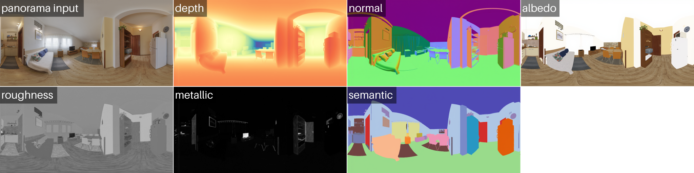

# ComfyUI‑OmniX (Diffusers Edition)

OmniX brings HKU-MMLab's panorama perception adapters to ComfyUI. This fork removes the legacy conversion pipeline and runs the original LoRA weights directly inside HuggingFace Diffusers' `FluxPipeline`, so every perception head (distance, normal, albedo, PBR) matches the official implementation.



---

## Requirements

| Component | Location | Notes |
|-----------|----------|-------|
| **Flux.1-dev Diffusers repo** | `ComfyUI/models/diffusers/flux1-dev/...` | Copy the full `black-forest-labs/FLUX.1-dev` repository (JSON configs + subfolders). |
| **Flux checkpoint** | `ComfyUI/models/diffusers/flux1-dev.safetensors` (or `.sft`) | Place the file beside the Diffusers repo; the loader never downloads weights. |
| **OmniX LoRA adapters** | `ComfyUI/models/loras/omnix/` | Download from `https://huggingface.co/KevinHuang/OmniX` (distance, normal, albedo, pbr, etc.). |
| **Panorama input** | Any 2:1 equirectangular image | Feed via ComfyUI’s `LoadImage` node. |

Python dependencies (Diffusers ≥ 0.29, PEFT ≥ 0.10, PyTorch ≥ 2.1) are listed in `requirements.txt`. Install them inside your ComfyUI environment.

---

## Installation

1. Navigate to `ComfyUI/custom_nodes/` and clone this repo or copy its folder:
   ```bash
   git clone https://github.com/cedarconnor/ComfyUI-OmniX.git
   ```
2. Install Python requirements (inside your ComfyUI venv):
   ```bash
   pip install -r ComfyUI-OmniX/requirements.txt
   ```
3. Copy the Flux Diffusers repo + checkpoint into `ComfyUI/models/diffusers/` (structure must match Diffusers’ layout).
4. Download OmniX adapters into `ComfyUI/models/loras/omnix/`.
5. Restart ComfyUI so the new nodes register.

---

## Node Overview

| Node | Purpose | Key Inputs | Output |
|------|---------|------------|--------|
| **FluxDiffusersLoader** | Loads `FluxPipeline` strictly from local files. | `torch_dtype` (bf16/fp16/fp32), `local_checkpoint` (filename). | Pipeline, VAE, text encoder. |
| **OmniXLoRALoader** | Injects OmniX LoRA adapters into the pipeline. | `adapter_dir`, booleans for distance/normal/albedo/pbr, `lora_scale`. | Patched pipeline + metadata dict. |
| **OmniXPerceptionDiffusers** | Runs one perception head using the patched pipeline. | `flux_pipeline`, `loaded_adapters`, panorama `IMAGE`, `task`, `num_steps`, `guidance_scale`, `noise_strength`. | Single perception map (`IMAGE`). |
| **Visualization nodes** | Post-process raw tensors. | Depth / Normal / Albedo / PBR specific parameters (gamma, percentiles, etc.). | Display-ready `IMAGE`. |

Typical workflow: `LoadImage → FluxDiffusersLoader → OmniXLoRALoader → OmniXPerceptionDiffusers (duplicated per head) → Visualization → SaveImage/Preview`.

---

## Recommended Settings per Output

| Output | noise_strength | num_steps | guidance_scale | Visualization Tips |
|--------|----------------|-----------|----------------|--------------------|
| **Distance** | 0.15–0.25 | 20–32 | 2.5–4.0 | Use `DepthVisualization` (viridis or grayscale) with percentiles (0.02 / 0.98). Low strength keeps geometry faithful. |
| **Normal** | 0.20–0.30 | 20–32 | 3.0–4.0 | `NormalVisualization`: enable `invert_y=True` (OpenGL convention) and set `gamma ≈ 0.8` for contrast. |
| **Albedo** | 0.30–0.40 | 24–36 | 3.5–5.0 | `AlbedoVisualization`: tweak `exposure` (0.9–1.1) and `gamma` to remove residual lighting. |
| **PBR (roughness/metallic)** | 0.25–0.35 | 24–36 | 3.0–4.0 | `PBRVisualization`: choose `mode="roughness"`, `"metallic"`, or `"combined"` to inspect both channels. |

> **Note:** `noise_strength` behaves like Diffusers img2img “strength”. Values above ~0.5 deliberately hallucinate new structures; drop it toward 0.1 for outputs that align closely with the source panorama.

---

## Workflow Usage Example

1. Load your panorama (`LoadImage`) and preview to ensure 2:1 aspect ratio.
2. Place `FluxDiffusersLoader` and select `torch_dtype="bfloat16"` (fastest on RTX 30/40) plus the `flux1-dev.safetensors` file.
3. Add `OmniXLoRALoader`, point `adapter_dir` to `ComfyUI/models/loras/omnix`, and enable the perception heads you need. This clears and reloads adapters each time, so you can safely requeue with new settings.
4. Duplicate `OmniXPerceptionDiffusers` four times (distance, normal, albedo, pbr) and wire them to the same panorama input. Set `noise_strength`, `guidance_scale`, and `num_steps` according to the table above.
5. Append visualization nodes for each branch:
   - Depth → `DepthVisualization` (`mode="viridis"`, `gamma=1.2`, `percentiles=0.02/0.98`).
   - Normal → `NormalVisualization` (`invert_y=True`, `gamma=0.8`).
   - Albedo → `AlbedoVisualization` (`exposure=0.95`, `gamma=1.1`, `saturation=0.9`).
   - PBR → `PBRVisualization` (`mode="combined"` for red=roughness, blue=metallic).
6. Connect each visualizer to a `SaveImage` / `PreviewImage` node with unique filenames (`omnix_depth`, `omnix_normal`, etc.).
7. Queue the workflow. Each branch runs sequentially on the shared pipeline, so there’s no need to reload Flux between tasks.

Example workflow JSON: `workflows/omnix_perception_visualizations.json` (load it via ComfyUI’s workflow manager).

---

## Troubleshooting

| Symptom | Fix |
|---------|-----|
| `Adapter 'XYZ' not loaded` | Ensure the checkbox for that adapter is enabled in `OmniXLoRALoader` and the `.safetensors` file exists in `models/loras/omnix/`. |
| `Adapter name ... already in use` | Requeue—OmniXLoRALoader now clears adapters automatically, but if you edited the pipeline manually restart ComfyUI. |
| Output looks like the source panorama | Lower `noise_strength` (0.1–0.2) to keep geometry; for stylized results, raise it. |
| Outputs look completely hallucinated | You likely ran with `noise_strength ≥ 0.6`. Drop it back to the recommended band for perception. |
| Diffusers missing files | Verify the directory tree matches Diffusers’ layout (`scheduler/`, `transformer/`, `text_encoder/`, etc.) and that `model_index.json` exists beside the checkpoint. |

Detailed setup guides live in `DOCS/QUICK_START_DIFFUSERS.md` and `MODEL_DOWNLOAD_GUIDE.md`.

---

## License / Credits

- OmniX adapters by **HKU‑MMLab** (`https://github.com/HKU-MMLab/OmniX`).
- Flux.1-dev by **Black Forest Labs**.
- ComfyUI by **comfyanonymous**.
- This repository is MIT/Apache-2.0 as per the original files.

Please cite OmniX if you use these perception maps in research or production. Enjoy! 🚀
