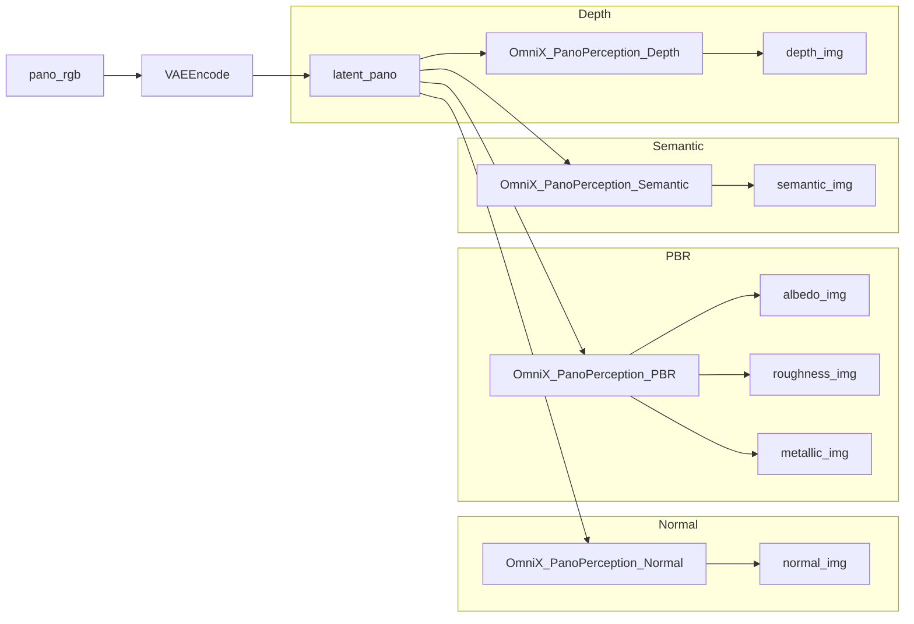

# OmniX + FLUX Panorama Perception for ComfyUI  
**Design Document (v0.1)**

Author: ChatGPT (with Cedar)  
Status: Draft / Implementable  
Scope: Custom ComfyUI node pack + example workflows integrating OmniX pano LoRAs and perception pipelines on top of FLUX.1-dev.

---

## 1. Objective

Integrate the **OmniX** panoramic generation + perception pipelines into **ComfyUI** using:

- **Base model:** `black-forest-labs/FLUX.1-dev` (or equivalent Comfy checkpoint)
- **LoRAs (converted to ComfyUI format):**
  - `text_to_pano/rgb` → text → RGB panorama
  - `rgb_to_depth/rgb` → RGB pano → depth map
  - `rgb_to_normal/rgb` → RGB pano → surface normals
  - `rgb_to_albedo/rgb` → RGB pano → albedo
  - `rgb_to_pbr/rgb` → RGB pano → roughness/metallic/etc.
  - `rgb_to_semantic/rgb` → RGB pano → semantic segmentation

The goal is a **minimal but powerful ComfyUI node architecture** that:

1. Works in a **fully native Comfy** graph (no external scripts at runtime).
2. Reuses Omnix’s logic for **pano perception** as faithfully as possible.
3. Supports three main workflows:
   - **W1:** Text → Pano (generation-only)
   - **W2:** Pano (image) → Perception (depth/normal/PBR/semantic)
   - **W3:** Text → Pano → Perception (full pipeline)

---

## 2. High-Level Architecture

### 2.1. Components

- **Base model & encoders**
  - FLUX.1-dev UNet / DiT (as “model” in Comfy)
  - Matching CLIP and VAE

- **Existing Comfy nodes (no changes)**
  - `CLIPTextEncode`, `CLIPTextEncode (neg)`
  - `EmptyLatentImage`
  - `Load Diffusion Model`
  - `LoraLoaderModelOnly` (or `Load LoRA` variant)
  - `KSampler`
  - `VAEDecode` / `VAEEncode`
  - `ImageSave`, `PreviewImage`, etc.

- **New custom node pack: `ComfyUI_OmniX`**
  - Core perception nodes wrapping OmniX functionality:
    - `OmniX_PanoPerception_Depth`
    - `OmniX_PanoPerception_Normal`
    - `OmniX_PanoPerception_PBR`
    - `OmniX_PanoPerception_Semantic`
  - Optional convenience helpers:
    - `OmniX_LoadFluxBase` (wrapper to ensure consistent Flux loading)
    - `OmniX_LoadOmniXLora` (preset LoRA loader with known defaults)

### 2.2. Data Flow Overview

**W1: Text → Pano (Generation)**

```mermaid
flowchart LR
  P[Prompt] --> TE[CLIPTextEncode+]
  N[Neg Prompt] --> TEn[CLIPTextEncode-]
  TE --> KS[KSampler]
  TEn --> KS
  L[EmptyLatentImage 2:1] --> KS
  M[Load Diffusion Model (FLUX dev)] --> ML[LoraLoaderModelOnly (text_to_pano)]
  ML --> KS
  KS --> VDEC[VAEDecode]
  VDEC --> PANO[pano_rgb (2:1)]
```

**W2: Pano → Perception**



**W3:** W1 + W2 chained (no extra components).

---

## 3. Dependencies & Environment

### 3.1. Core Software

- **ComfyUI** (latest stable)
- **Python** 3.10+ recommended
- Libraries (subset):
  - `torch`
  - `safetensors`
  - `numpy`
  - Optional: `peft`, `nunchaku` for LoRA conversion scripts (not required at runtime)

### 3.2. Model Assets

- FLUX dev base model checkpoint (Comfy format).
- Converted OmniX LoRAs (Diffusers → Comfy Flux-UNet format):
  - `OmniX_text_to_pano_rgb_comfyui.safetensors`
  - `OmniX_rgb_to_depth_comfyui.safetensors`
  - `OmniX_rgb_to_normal_comfyui.safetensors`
  - `OmniX_rgb_to_albedo_comfyui.safetensors`
  - `OmniX_rgb_to_pbr_comfyui.safetensors`
  - `OmniX_rgb_to_semantic_comfyui.safetensors`

Suggested directory layout:
```text
ComfyUI/
  custom_nodes/
    ComfyUI_OmniX/
      __init__.py
      omni_x_nodes.py
      omni_x_utils.py
      README.md
  models/
    checkpoints/
      flux1-dev.safetensors
    loras/
      OmniX_text_to_pano_rgb_comfyui.safetensors
      OmniX_rgb_to_depth_comfyui.safetensors
      OmniX_rgb_to_normal_comfyui.safetensors
      OmniX_rgb_to_albedo_comfyui.safetensors
      OmniX_rgb_to_pbr_comfyui.safetensors
      OmniX_rgb_to_semantic_comfyui.safetensors
```

---

## 4. Detailed Node Design

### 4.1. `OmniX_LoadFluxBase` (optional helper)

**Purpose**  
Ensure the correct FLUX dev checkpoint and associated config are loaded in a consistent, OmniX-compatible way.

**Inputs**  
- `model_name: str` – default: `flux1-dev.safetensors`
- `device: str` – default: `"auto"`

**Outputs**  
- `model` – Comfy model object compatible with Flux + OmniX LoRAs

**Behavior (pseudo):**

```python
def load_flux_base(model_name="flux1-dev.safetensors", device="auto"):
    # Wrap Comfy's internal model loader for FLUX
    model = comfy.load_model(model_name, device=device)
    return model
```

This node can be skipped if you’re already comfortable with Comfy’s standard `Load Diffusion Model` node.

---

### 4.2. `OmniX_LoadOmniXLora` (optional helper)

**Purpose**  
Quality-of-life wrapper around `LoraLoaderModelOnly` for known OmniX LoRAs, with pre-filled names and strengths.

**Inputs**  
- `model` – base FLUX model
- `task: enum` – one of:
  - `TEXT_TO_PANO`
  - `RGB_TO_DEPTH`
  - `RGB_TO_NORMAL`
  - `RGB_TO_ALBEDO`
  - `RGB_TO_PBR`
  - `RGB_TO_SEMANTIC`
- `strength: float` – default `1.0`

**Outputs**  
- `model_lora` – LoRA-applied model

**Behavior**  

- Map `task` → LoRA filename.
- Call Comfy’s internal LoRA load/apply (or wrap `LoraLoaderModelOnly` logic).
- Return augmented model.

For power users, this node is optional because they can just use standard LoRA nodes.

---

### 4.3. Shared Perception Node Contract

All perception nodes are variants of a **shared internal implementation**. Core idea:

- Take a **Flux model + specific perception LoRA**.
- Take a **pano latent** (VAE-encoded RGB panorama).
- Perform a forward pass and map output tensors to images (depth, normal, PBR, semantics…).

**Common Inputs**  

- `model` – FLUX base + appropriate OmniX perception LoRA.
- `pano_latent` – latent representation of the panorama from `VAEEncode`.
- `steps: int` (optional) – iterative refinement steps; default 1–5 (can be internal to node).
- `guidance: float` (optional) – if OmniX uses any guidance-like scheme.
- `normalize_output: bool` – default `True`.

**Common Implementation Sketch**  

```python
def omni_x_forward(model, pano_latent, mode, **kwargs):
    # mode: 'depth', 'normal', 'pbr', 'semantic'

    # 1. Prepare input (latents or decoded image)
    pano = vae_decode_if_needed(pano_latent)  # or direct latent use

    # 2. Run OmniX-specific forward pass (ported from run_pano_perception.py)
    with torch.no_grad():
        result = model_omni_x_perception(model, pano, mode=mode, **kwargs)

    # 3. Post-process into image maps
    if mode == "depth":
        img = depth_to_grayscale(result)  # scale to 0–1 / 0–255
    elif mode == "normal":
        img = normals_to_rgb(result)      # map -1..1 to 0..1
    elif mode == "pbr":
        albedo, rough, metal = split_pbr_channels(result)
    elif mode == "semantic":
        img = semantic_to_palette(result) # apply color LUT

    return ready_to_comfy_images(...)
```

The actual details come from the OmniX repo’s `run_pano_perception.py` and related utils; those functions should be ported or imported as `omni_x_utils.py`.

---

### 4.4. `OmniX_PanoPerception_Depth`

**Inputs**  

- `model` – FLUX model + `rgb_to_depth` LoRA
- `pano_latent` – latent pano
- `normalize_output: bool` – default `True`

**Outputs**  

- `depth_img` – single-channel or 3-channel depth visualization image (for now, 3-channel grayscale RGB is easiest for Comfy)

**User-Facing Behavior**  

- User connects the panorama latent.
- Node outputs a depth visualization that can be previewed or saved.
- Internally, it should also expose unnormalized depth if needed in future versions (e.g., for geometry reconstruction).

---

### 4.5. `OmniX_PanoPerception_Normal`

**Inputs**  

- `model` – FLUX model + `rgb_to_normal` LoRA
- `pano_latent`
- `normalize_output: bool` – ensures normals in 0–1 RGB space.

**Outputs**  

- `normal_img` – 3-channel RGB normal map

**Internal Notes**  

- Internally, the network likely outputs normals in `[-1, 1]`. Map to `[0, 1]` or `[0, 255]` for display:
  - `rgb = (normals * 0.5 + 0.5)`

---

### 4.6. `OmniX_PanoPerception_PBR`

**Inputs**  

- `model` – FLUX model + `rgb_to_pbr` LoRA
- `pano_latent`
- `normalize_output: bool`

**Outputs**  

- `albedo_img` – RGB albedo
- `roughness_img` – single-channel or RGB roughness
- `metallic_img` – single-channel or RGB metallic

**Implementation Notes**  

- The OmniX network likely packs channels as `[albedo (3), rough (1), metal (1)]` or similar. The port must replicate exactly.
- For Comfy, you can split channels and expand to 3-channel for convenience if needed.

---

### 4.7. `OmniX_PanoPerception_Semantic`

**Inputs**  

- `model` – FLUX model + `rgb_to_semantic` LoRA
- `pano_latent`
- `palette: enum/str` – choose a color palette / LUT (optional)

**Outputs**  

- `semantic_img` – colorized semantic segmentation map

**Implementation Notes**  

- Internally, the network may output class logits or IDs; map to a palette (N classes → N colors).
- You may also expose a raw `id_map` tensor as future API.

---

## 5. Example Workflows

### 5.1. W1 – Text → Pano (Generation Only)

**Nodes (minimal):**

1. `CLIPTextEncode` (prompt)
2. `CLIPTextEncode` (negative prompt)
3. `EmptyLatentImage` (2:1)
4. `Load Diffusion Model` (FLUX dev)
5. `LoraLoaderModelOnly` (with `OmniX_text_to_pano_rgb_comfyui.safetensors`)
6. `KSampler`
7. `VAEDecode`
8. `PreviewImage` or `ImageSave`

**Prompt Suggestions:**

- `a photorealistic 360° panorama of a cozy modern living room, equirectangular, interior, ultra wide, 8k, highly detailed`
- `a 360° HDRI panorama of a futuristic neon city street at night, cinematic lighting, volumetric fog, ultrarealistic`

### 5.2. W2 – Pano (Image) → Perception

**Nodes:**

1. `ImageLoad` (external pano)
2. `VAEEncode` → `pano_latent`
3. `Load Diffusion Model` (FLUX dev)
4. `LoraLoaderModelOnly` with appropriate perception LoRA
5. `OmniX_PanoPerception_*` (depth/normal/PBR/semantic)
6. `PreviewImage` / `ImageSave`

The user can run each perception node separately or build a “fan-out” graph that produces all maps from the same latent.

### 5.3. W3 – Text → Pano → Perception (Full OmniX-like Pipeline)

**Nodes:** W1 + W2, chained:

- Use **W1** up to `pano_rgb`.
- Encode `pano_rgb` with `VAEEncode`.
- Run multiple `OmniX_PanoPerception_*` nodes in parallel from `pano_latent`.

---

## 6. Implementation Plan

1. **LoRA Conversion**
   - Use a script (e.g., using `nunchaku`) to convert all OmniX LoRAs from Diffusers PEFT format → Comfy FLUX LoRA format.
   - Sanity-check outputs by verifying key naming schemes (e.g. `lora_unet_double_blocks_*`).

2. **Repo Skeleton**
   - Create `ComfyUI_OmniX` under `custom_nodes/` with:
     - `__init__.py`
     - `omni_x_nodes.py` (node classes)
     - `omni_x_utils.py` (ported functions from OmniX repo)
     - `README.md`

3. **Core Node Implementations**
   - Implement `NODE_CLASS_MAPPINGS` and `NODE_DISPLAY_NAME_MAPPINGS`.
   - Implement minimal versions of perception nodes using placeholder functions.
   - Gradually replace placeholders with actual OmniX perception logic.

4. **Validation**
   - For a given pano, run OmniX’s original `run_pano_perception.py` and compare outputs with Comfy’s `OmniX_PanoPerception_*` nodes (pixel-wise, within tolerance).
   - Confirm consistent visualization for depth/normal/PBR/semantic.

5. **Performance Tuning**
   - Profile memory usage and runtime on typical resolutions (e.g., 1024×2048).
   - Possibly add batch support or tiling for large panoramas.

6. **Docs & Examples**
   - Provide sample Comfy graphs (.json workflows) for W1, W2, W3.
   - Document best practices: prompt formats, resolutions, LoRA strengths.

---

## 7. Risks & Mitigations

- **Risk:** Incorrect reproduction of OmniX perception logic → wrong maps.  
  **Mitigation:** Side-by-side comparison with `run_pano_perception.py`; add unit tests that compare tensors.

- **Risk:** Large pano resolution → GPU OOM.  
  **Mitigation:** Provide recommended resolutions (e.g., 1024×2048), optional tiling strategies or latent stride options.

- **Risk:** LoRA conversion mismatch.  
  **Mitigation:** Use a single, well-tested conversion script; verify shapes and key mappings; maintain a small CLI tool to diff state dicts.

---

## 8. Future Extensions

- Combine perception outputs with 3D reconstruction workflows (Gaussian splats, meshes) inside Comfy.
- Add a “one-stop” node that runs all perception modes and outputs a dictionary of maps.
- Add node presets tuned for specific tasks (lighting reconstruction, environment map export, etc.).
- Offer an optional **colmap / gsplat** integration to turn pano + depth into actual geometry.  

---

End of design document.
